# Walmart销量预测Demo - 完整部署教程

## 📋 概述

本教程将指导您在阿里云PAI平台上部署完整的Walmart销量预测MLOps流程。整个系统包含：
- **MaxCompute**: 数据存储和计算
- **DataWorks**: 数据处理和任务调度  
- **DSW**: 模型训练和开发
- **EAS**: 模型部署和在线推理

## 🛠️ 前置准备

### 阿里云账号和服务开通

#### 1. 开通PAI服务
- ✅ 登录 [PAI控制台](https://pai.console.aliyun.com/?spm=a2c4g.11186623.0.0.39156d22kRyjIo)
- ✅ 左上角选择开通区域，然后一键开通并创建默认工作空间

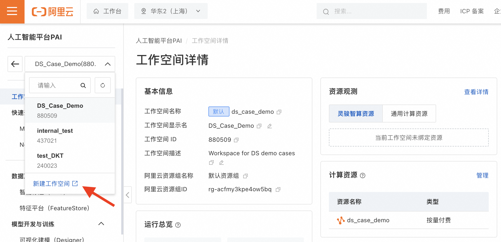

#### 2. 开通OSS对象存储
- ✅ [开通OSS](https://oss.console.aliyun.com/overview?spm=a2c4g.11186623.0.0.d1477031quQo7q)并[创建Bucket](https://oss.console.aliyun.com/?spm=a2c4g.11186623.0.0.d1477031quQo7q)

<p align="center">
  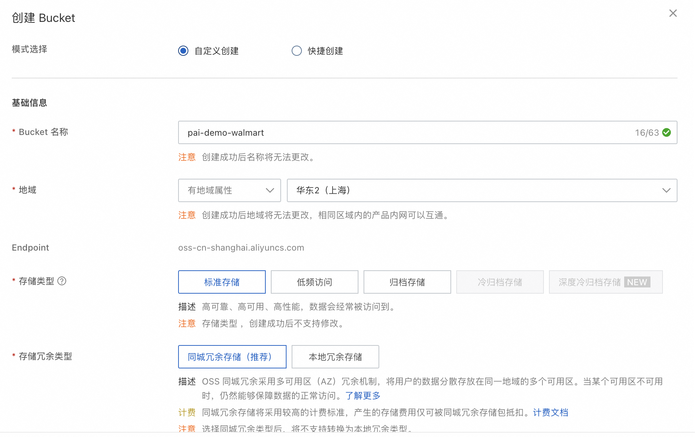
  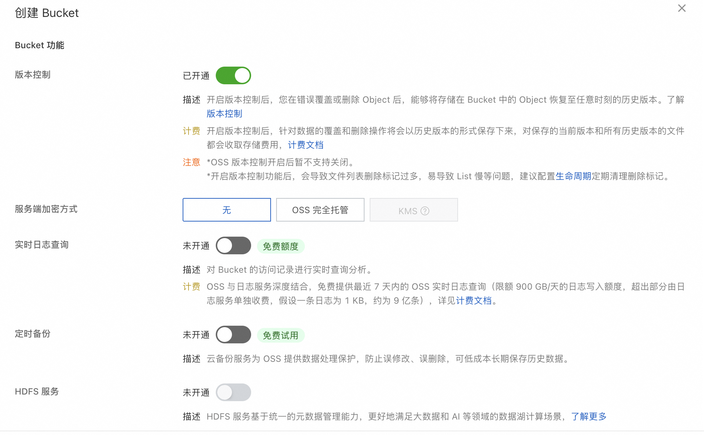
</p>

#### 3. 开通MaxCompute服务
- ✅ 访问 [MaxCompute控制台](https://maxcompute.console.aliyun.com/cn-shanghai/overview)
- ✅ 选择DataWorks组合开通

#### 4. 创建DSW实例
1. 登录 [PAI控制台](https://pai.console.aliyun.com/?spm=a2c4g.11186623.0.0.39156d22kRyjIo)
2. 进入项目工作空间后，在左侧导航栏选择：**模型开发与训练** > **交互式建模（DSW）** > **新建实例**

<p align="center">
  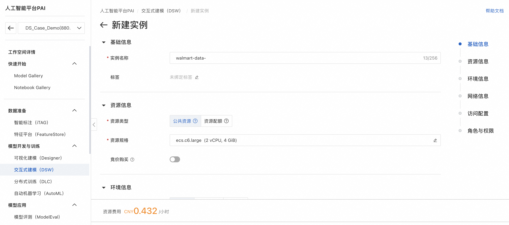
  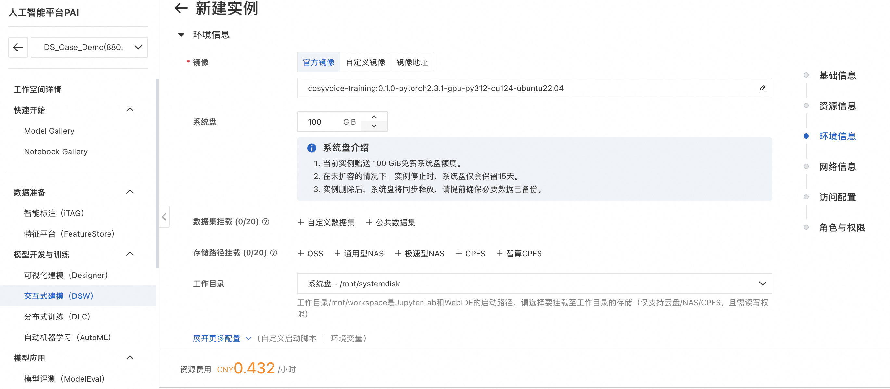
</p>


> **📝 重要提示：**
> - 运行此demo只需选择**最低配置的CPU**即可
> - DSW实例运行时会产生费用，**使用后记得关闭**
> - 建议将模型文件拷贝至OSS中持久化存储
> - 公共资源组的DSW实例停机超过15天，云盘内容将被清空

#### 5. 开通PAI-EAS服务
- ✅ 在PAI控制台中开通EAS模型在线服务

#### 6. 创建AccessKey
- ✅ 创建具备MaxCompute权限的AccessKey
- ✅ 妥善保存AccessKey ID和AccessKey Secret

---

## 🚀 Phase 1: 环境设置和代码获取

### 步骤1.1: 克隆项目代码
1. **启动DSW实例**：
   - 访问PAI控制台 → DSW
   - 创建或启动一个DSW实例

2. **在DSW Terminal中克隆代码**：
```bash
cd /mnt/workspace
git clone https://github.com/zjgxky/walmart-pai-demo.git
cd walmart-pai-demo
```

### 步骤1.2: 配置访问信息
1. **复制配置模板**：
```bash
cp config.yaml config_local.yaml
```

2. **编辑配置文件**：
```bash
vi config_local.yaml
```

3. **填入您的真实信息**：
```yaml
maxcompute:
  access_id: "您的AccessKey_ID"          # 替换为真实值
  access_key: "您的AccessKey_Secret"      # 替换为真实值
  project: "您的MaxCompute项目名"         # 替换为真实值
  endpoint: "https://service.cn-shanghai.maxcompute.aliyun.com/api"  # 根据地域调整
```

4. **验证配置**：
```bash
python -c "
import yaml
with open('config_local.yaml') as f:
    config = yaml.safe_load(f)
print('配置验证通过:', config['maxcompute']['project'])
"
```

---

## 📊 Phase 2: 数据准备（MaxCompute + DSW）

### 步骤2.1: 创建原始表结构
1. **MaxCompute控制台**
2. **选择刚才创建的项目**
2. **点开左侧工作区 - SQL分析**
3. **在SQL编辑器中执行建表脚本**：
```sql
-- 运行 sql/create_tables.sql 中的内容
CREATE TABLE IF NOT EXISTS walmart_sales_raw (
    Store BIGINT,
    Date STRING,
    Weekly_Sales DOUBLE,
    Holiday_Flag BIGINT,
    Temperature DOUBLE,
    Fuel_Price DOUBLE,
    CPI DOUBLE,
    Unemployment DOUBLE
);
```
5. **建表完成，表结构存储到MaxCompute**
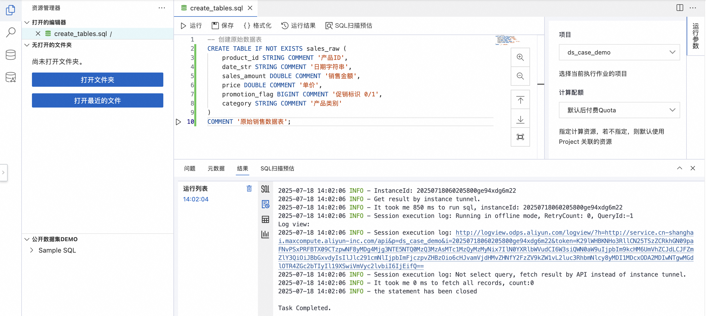

**注：后续所有成功存储在MaxCompute的表格都可以在这找到：**
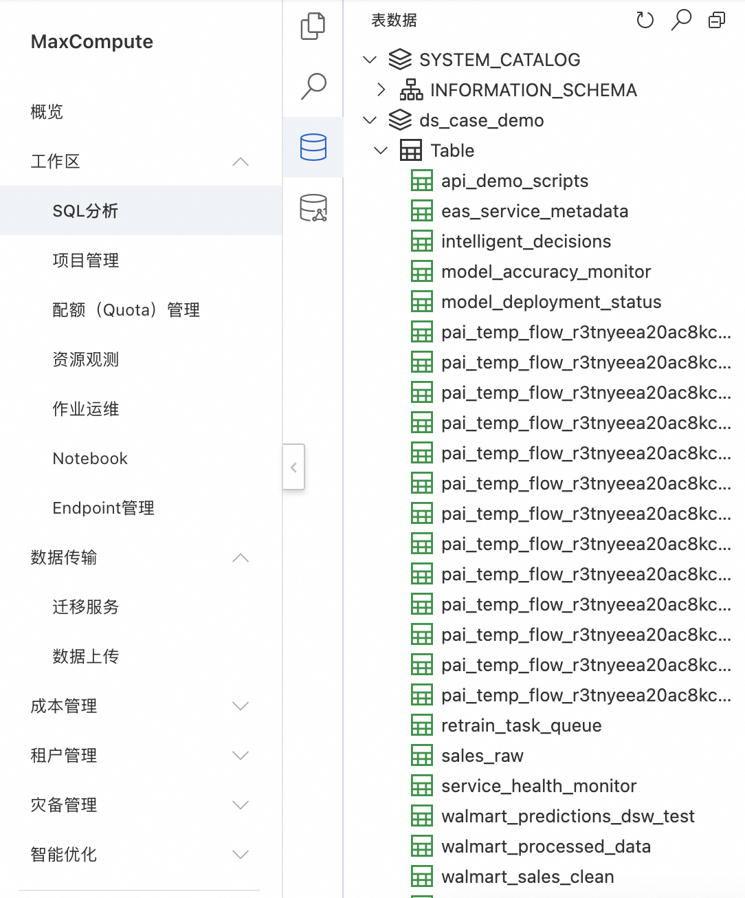


### 步骤2.2: 上传原始数据

#### 方法1: 利用DataWorks网页端
1. **打开DataWorks数据上传页面**
   - 访问：[DataWorks数据上传与下载](https://dataworks.data.aliyun.com/cn-shanghai/uad#/upload?type=create)

2. **从本地/OSS上传表格**
<p align="center">
   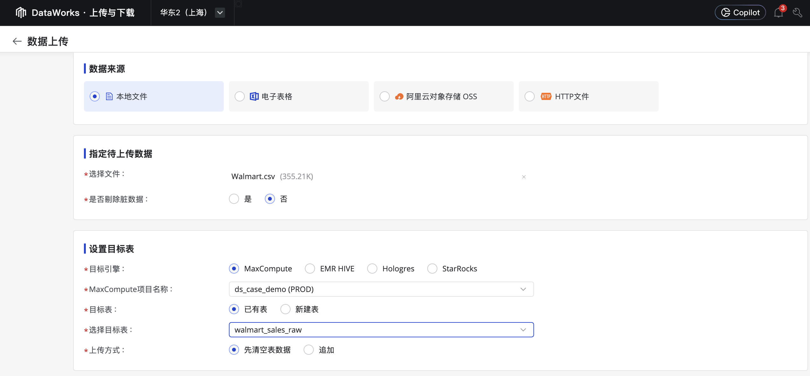
   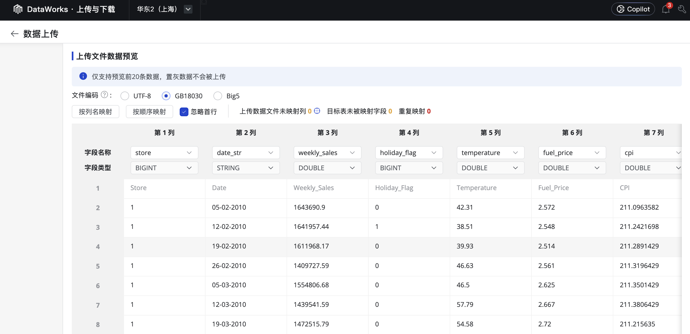
<p>

#### 方法2: 利用DSW脚本
1. **在DSW中打开** `notebooks/Upload_Source_File.ipynb`

2. **运行所有cells**，这将：
   - 读取本地的 `Walmart.csv` 文件
   - 上传数据到MaxCompute的 `walmart_sales_raw` 表

3. **验证数据上传**：
```sql
SELECT COUNT(*) FROM walmart_sales_raw;
-- 应该显示 6435 行数据
```
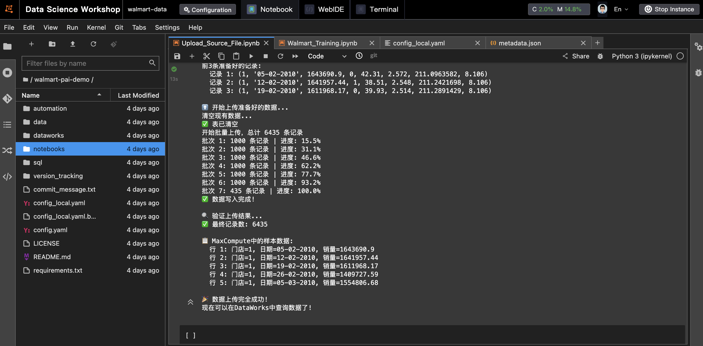


---

## 🔧 Phase 3: 数据处理（DataWorks）

### 步骤3.1: 创建DataWorks业务流程
1. **登录DataWorks控制台**
2. **进入数据开发**
3. **创建业务流程**：
   - 流程名称：`walmart_data_pipeline`
   - 描述：Walmart销量预测数据流水线

### 步骤3.2: 创建数据预处理节点
1. **在业务流程中创建节点**：
   - 节点类型：PyODPS 3
   - 节点名称：`walmart_data_eda`
   - 描述：数据探索和预处理

2. **复制代码内容**：
   - 将 `dataworks/data_eda.py` 的内容复制到节点中
   - 保存节点

### 步骤3.3: 创建特征工程节点  
1. **创建第二个节点**：
   - 节点类型：PyODPS 3
   - 节点名称：`walmart_feature_engineering`
   - 描述：VIF特征工程和数据分割

2. **复制代码并设置依赖**：
   - 将 `dataworks/feature_engineering.py` 的内容复制到节点中
   - 设置上游依赖：`walmart_data_eda`
   - 保存节点

### 步骤3.4: 运行数据处理流程
1. **提交并发布节点**：
   - 右键节点 → 提交
   - 进入运维中心 → 发布

2. **运行流程**：
   - 运维中心 → 周期任务
   - 找到 `walmart_data_eda` → 运行
   - 等待完成后，运行 `walmart_feature_engineering`

3. **验证结果**：
```sql
-- 检查处理后的数据
SELECT COUNT(*) FROM walmart_processed_data;
SELECT COUNT(*) FROM walmart_train_vif;
SELECT COUNT(*) FROM walmart_test_vif;
```

---

## 🤖 Phase 4: 模型训练（DSW）

### 步骤4.1: 配置训练环境
1. **在DSW中打开** `notebooks/Walmart_Training.ipynb`
2. **确保配置文件正确**：
   - `config_local.yaml` 应该已在Phase 1配置好
   - 如果遇到配置加载问题，notebook开头有自动修复代码

### 步骤4.2: 执行模型训练
1. **运行训练脚本**：
   - 依次运行notebook中的所有cells
   - 训练过程包括：
     - 数据加载和验证
     - 三种模型训练（线性回归、弹性网络、随机森林）
     - 模型评估和比较
     - 模型保存和注册

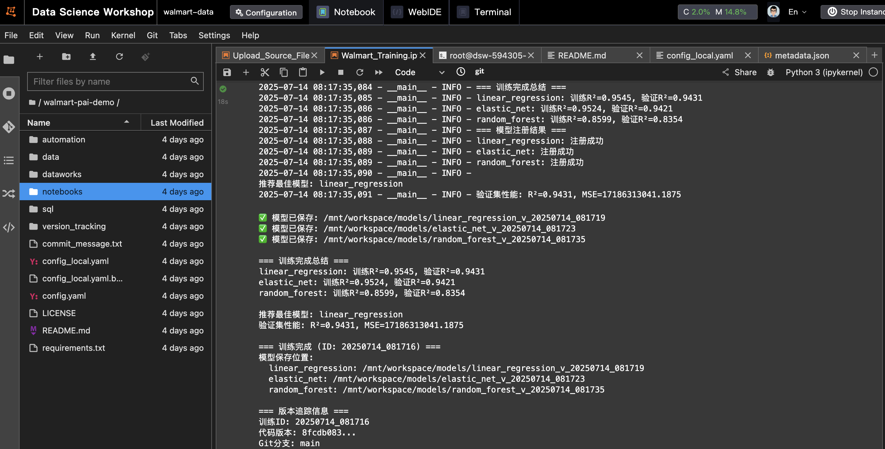


2. **验证训练结果**：
   - 检查 `/mnt/workspace/models/` 目录下的模型文件
   - 确认训练总结文件生成
   - 验证模型注册到PAI Model Registry

### 步骤4.3: 检查训练输出
训练完成后，您应该看到：
```
/mnt/workspace/models/
├── linear_regression_v_YYYYMMDD_HHMMSS/
│   ├── model.pkl
│   ├── metadata.json
│   └── reproduce.sh
├── elastic_net_v_YYYYMMDD_HHMMSS/
├── random_forest_v_YYYYMMDD_HHMMSS/
└── training_summary_YYYYMMDD_HHMMSS.json
```

---

## 🎯 Phase 5: 批量预测（DataWorks）

### 步骤5.1: 创建批量预测节点
1. **在DataWorks业务流程中创建新节点**：
   - 节点类型：PyODPS 3
   - 节点名称：`walmart_batch_prediction`
   - 描述：批量预测最佳模型

2. **配置节点**：
   - 将 `dataworks/batch_prediction.py` 内容复制到节点
   - 设置上游依赖：`walmart_feature_engineering`

### 步骤5.2: 运行批量预测
1. **提交并运行节点**
2. **验证预测结果**：
```sql
-- 检查预测结果
SELECT COUNT(*) FROM walmart_sales_predictions_v2;
SELECT model_name, COUNT(*) as prediction_count 
FROM walmart_sales_predictions_v2 
GROUP BY model_name;

-- 检查部署状态
SELECT * FROM model_deployment_status_v2;
```

---

## 🚀 Phase 6: 模型部署（DataWorks + EAS）

### 步骤6.1: 创建EAS部署节点
1. **创建部署节点**：
   - 节点类型：PyODPS 3
   - 节点名称：`deploy_model_to_eas`
   - 描述：部署模型到EAS服务

2. **配置节点**：
   - 复制 `dataworks/deploy_model_to_eas.py` 内容
   - 设置依赖：`walmart_batch_prediction`

### 步骤6.2: 运行部署流程
1. **运行部署节点**
2. **验证部署结果**：
```sql
-- 检查EAS服务信息
SELECT * FROM eas_service_metadata;
-- 检查API调用示例
SELECT * FROM api_demo_scripts;
```

---

## 📊 Phase 7: 监控和反馈（DataWorks）

### 步骤7.1: 创建监控节点
1. **创建监控节点**：
   - 节点类型：PyODPS 3
   - 节点名称：`monitor_model_performance`
   - 描述：模型性能监控和自动重训练决策

2. **配置节点**：
   - 复制 `dataworks/monitor_model_performance.py` 内容
   - 设置依赖：`deploy_model_to_eas`

### 步骤7.2: 设置自动化触发
1. **创建自动训练触发节点**：
   - 节点名称：`automated_training_trigger`
   - 复制 `dataworks/automated_training_trigger.py` 内容

2. **配置调度**：
   - 设置定期执行（如每日检查）
   - 配置告警通知

---

## 🧪 Phase 8: 测试和验证

### 步骤8.1: 端到端测试
1. **在DSW中运行测试脚本**：
```bash
# 创建测试notebook
jupyter notebook notebooks/test_batch_prediction.ipynb
```

2. **验证各个组件**：
   - ✅ 数据流水线正常
   - ✅ 模型训练成功
   - ✅ 批量预测工作
   - ✅ EAS部署完成
   - ✅ 监控系统运行

### 步骤8.2: API测试
1. **获取API调用示例**：
```sql
SELECT script_content FROM api_demo_scripts WHERE script_type = 'curl';
```

2. **测试API调用**（模拟，实际EAS部署需要真实环境）

---

## 📋 完整业务流程图

最终的DataWorks业务流程应该是：
```
walmart_data_pipeline
├── walmart_data_eda
│   └── 输出: walmart_processed_data
├── walmart_feature_engineering  
│   ├── 输入: walmart_processed_data
│   └── 输出: walmart_train_vif, walmart_test_vif
├── walmart_batch_prediction
│   ├── 输入: walmart_test_vif + 训练模型
│   └── 输出: 预测结果 + 部署状态
├── deploy_model_to_eas
│   └── 输出: EAS服务 + API示例
├── monitor_model_performance  
│   └── 输出: 监控指标 + 重训练决策
└── automated_training_trigger
    └── 输出: 自动化触发任务
```

---

## 🆘 故障排除

### 常见问题和解决方案

**1. 配置文件加载失败**
```bash
# 检查配置文件
ls -la config_local.yaml
# 验证YAML格式
python -c "import yaml; yaml.safe_load(open('config_local.yaml'))"
```

**2. MaxCompute连接失败**
- 检查AccessKey权限
- 验证endpoint地址
- 确认项目名称正确

**3. DataWorks节点运行失败**
- 检查节点依赖关系
- 验证上游数据是否就绪
- 查看详细错误日志

**4. 模型训练内存不足**
- 增加DSW实例配置
- 或减少数据量进行测试

**5. Git相关问题**
- 确保使用Personal Access Token而不是密码
- 检查token权限设置

---

## 📞 技术支持

如果遇到问题，请按以下顺序排查：

1. **检查配置文件**：确保`config_local.yaml`正确配置
2. **验证权限**：确认AccessKey有足够权限
3. **查看日志**：DataWorks节点运行日志包含详细错误信息  
4. **数据验证**：确认每个阶段的输出数据正确
5. **联系支持**：提供具体错误信息和环境配置

---

## 🎯 预期结果

完成整个流程后，您将拥有：

- ✅ **完整的MLOps流水线**：从数据处理到模型部署
- ✅ **自动化训练和部署**：支持模型版本管理
- ✅ **监控和反馈系统**：自动检测模型性能下降
- ✅ **可复现的训练流程**：完整的代码版本追踪
- ✅ **企业级部署架构**：支持扩展和生产使用

整个demo展示了在阿里云PAI平台上构建端到端机器学习系统的最佳实践！